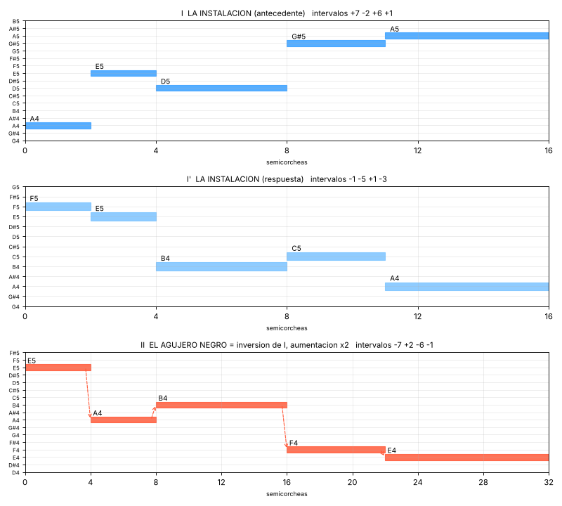
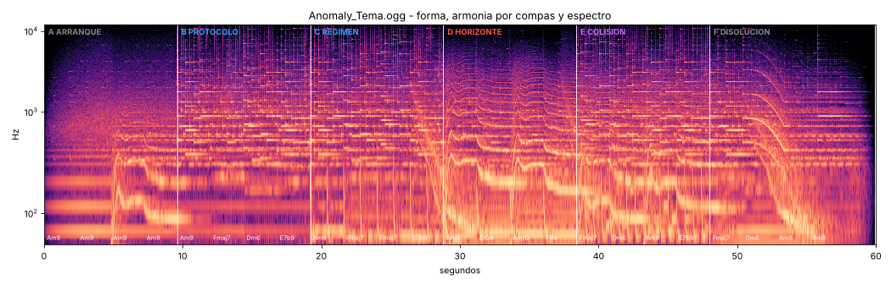

# Música de AN∅MALY: leitmotivs, síntesis y progresión del OST

Este documento define la identidad musical propia del juego. El tema
principal, `assets/Musica/Anomaly_Tema.ogg`, dura 60 s y está hecho
**100 % por síntesis de sonido**: no usa samples ni grabaciones. Su código
fuente está en `music/`.

```
python3 music/generar_tema.py                     # assets/Musica/Anomaly_Tema.ogg
python3 music/generar_tema.py --stems music/capas # + las tres capas por separado
python3 music/figuras.py                          # figuras de docs/musica/
```

Requiere `numpy`, `numba` y `ffmpeg` (más `matplotlib` y `soundfile` solo para
las figuras). La semilla es fija, así que el mismo código siempre genera el
mismo archivo. La carpeta `music/` tiene un `.gdignore` y Godot no la importa.

---

## 1. Punto de partida: qué hace la música actual del menú

`assets/MenuMusic.ogg` es de *Portal Reloaded*. Analizada por espectro y
croma, tiene estas características:

| Rasgo | Medición | Qué transmite |
|---|---|---|
| Tonalidad | **La menor** con G# muy presente (menor armónica) | laboratorio frío con una tensión que nunca termina de resolver |
| Tempo | ~100 BPM | pulso de máquina, ni calmo ni urgente |
| Bajo | pedal casi constante en **A1** | la instalación siempre encendida |
| Arriba | líneas cromáticas (B-C-C#, D-D#-E) sobre arpegios | precisión mecánica con pequeñas "fallas" |
| Espectro | 90 % de la energía entre 250 Hz y 4 kHz y casi nada sobre 4 kHz | brillante pero "vieja", como un monitor CRT |

En el lenguaje de Portal 2 (Mike Morasky), esto corresponde a secuenciadores
de onda cuadrada que se traban, arpegios como relojes, ecos ping-pong,
bitcrush y una armonía clínica que se oscurece de a poco. Esa es la sensación
que hay que conservar. Lo que falta es un **tema propio** que hable del
juego: una instalación que contiene una singularidad.

El resto del OST actual, medido igual:

| Pista | Dónde suena | Tonalidad aprox. | BPM | Carácter |
|---|---|---|---|---|
| MenuMusic | menú | La menor | 100 | brillante, arpegiada |
| BackgroundMusic | sala, en bucle | Fa / Do menor | ~129 | grave (50 % < 80 Hz), ambiental |
| Interfacing | fase 2 | Do menor | 100 | medios-graves, mecánica |
| Singularity | fase 3 | ambigua (Re# / Fa menor) | 100 | oscura (centroide 750 Hz) |
| KineticEnergy | meltdown | Do menor | ~117 | sub dominante, urgente |

---

## 2. Los dos leitmotivs



### I. LA INSTALACIÓN

```
A4  E5  D5  G#5  A5        intervalos  +7  -2  +6  +1
2   2   4   3    5         semicorcheas (= un compás exacto)
```

- **Empieza en la tónica y sube una quinta.** La quinta es el intervalo más
  estable: representa estructura, ingeniería y orden.
- **D5 → G#5 es un tritono.** Es la grieta dentro de la máquina: el intervalo
  más inestable, metido en medio del orden.
- **G#5 → A5 es la sensible que resuelve.** La instalación corrige su propia
  falla: el ciclo se cierra.
- El ritmo 2-2-4-3-5 llena un compás justo. Cada vez que suena el tema, es un
  ciclo completo de la máquina.
- **Timbre:** cristal FM, con la portadora 1:3 y un índice de modulación que
  cae en 90 ms (un golpe brillante que se vuelve tono puro), más un pulso
  suave una octava abajo. Afinación perfecta, sin vibrato: la instalación
  no duda.

**Respuesta (I')**: `F5 E5 B4 C5 A4`, con el mismo ritmo. Baja de vuelta a la
tónica y forma con I una frase de pregunta y respuesta.

**Fragmento "la grieta"**: `A4 E5 D5 G#5` con G#5 sostenido y sin resolver.
Cierra cada frase sobre el acorde de E7(b9). Es la instalación al límite.

### II. EL AGUJERO NEGRO

```
E5  A4  B4  F4  E4         intervalos  -7  +2  -6  -1
4   4   8   6   10         semicorcheas (= dos compases)
```

- Es la **inversión exacta** de I: cada intervalo cambia de sentido. El
  agujero negro es la instalación vista en un espejo.
- Va en **aumentación x2**: las mismas proporciones al doble de duración.
  Es la dilatación temporal cerca del horizonte de sucesos.
- Donde I sube una quinta, II cae una quinta. Donde I salta un tritono hacia
  arriba, II se desploma un tritono (B4 → F4). Donde I resuelve medio tono
  hacia arriba, II se hunde medio tono (F4 → E4) y queda en la dominante,
  sin volver a casa.
- **Timbre:** cinco sierras desafinadas con un sub seno, un filtro de 24 dB y
  portamento entre las notas. Antes de cada salto la nota cae un poco
  (arrastre gravitacional). La última nota se **corre al rojo**: baja entre
  0.5 y 1.5 semitonos mientras suena, y el vibrato crece en las notas largas.

**La relación entre los dos es el núcleo del OST.** Cualquier variación de
uno debe poder leerse como una deformación del otro.

### Transformaciones permitidas

Están en `music/sintesis/leitmotivs.py` (clase `Motif`), así que la
partitura nunca escribe los temas a mano:

| Transformación | Uso dramático |
|---|---|
| `transpose(+3)` (I sobre C) | la instalación funcionando a régimen |
| `transpose(-2)`, `transpose(-7)` (II) | cada aparición del agujero negro cae más bajo: nos hundimos |
| `augment(2)` sobre I | la instalación atrapada en el tiempo dilatado: se está perdiendo |
| `octave(±1)` | capas de la colisión |
| `head(4)` (la grieta) | tensión sin resolver |
| `invert()` | de I se obtiene II; aplicada a II, devuelve I |
| `retrograde()` | reservada para el final "bueno" (ver §5) |

---

## 3. El tema principal: forma y armonía

100 BPM, 4/4, La menor armónica. Un compás dura 2.4 s. Son 24 compases más
la cola (60 s).



| Compases | Sección | Armonía | Qué pasa |
|---|---|---|---|
| 1-4 | **A ARRANQUE** | Am9 (pedal) | Solo textura: zumbido del reactor y ventilación. En el compás 3, II asoma muy lejos, una octava abajo y casi sin brillo, como presagio. |
| 5-8 | **B PROTOCOLO** | Am9, Fmaj7(#11), Dm6, E7(b9) | Entra el secuenciador (arpegio en semicorcheas). Suena I y, como eco lejano, su resolución G#-A. Después I' y la grieta. El reloj se traba en el último tiempo (ratchet). |
| 9-12 | **C RÉGIMEN** | Am9, Fmaj7, Fmaj7(#11), E7(b9) | Bajo en corcheas y bombo a medio tiempo con sidechain. Suenan I, I' e I transportado a C (C-G-F-B-C cae justo sobre Fmaj7#11). Cierra la grieta. |
| 13-16 | **D HORIZONTE** | Am9, E/G#, Am/G, F#ø | **Bajo de lamento cromático A-G#-G-F#** en legato, deslizándose. II completo y luego un tono abajo. **El arpegio se dilata**: cada paso dura 4.7 % más que el anterior (de 0.15 s a 0.6 s) y la afinación cae medio tono. La nube granular baja una octava. |
| 17-20 | **E COLISIÓN** | Fmaj7, Dm6, Am9, E7(b9) | **Los dos leitmotivs a la vez**: I arriba (en C, I', en A y la grieta) y II abajo (una octava abajo y luego en A, terminando en A#-A sobre E7b9). Bombo en negras. Es el punto de máxima energía. |
| 21-24 | **F DISOLUCIÓN** | Fmaj7, Dm6, Am9, Am9 | I en aumentación x2. **G#5 nunca llega a A5**: el agujero negro la arrastra en glissando hasta E4, la nota final de II. El secuenciador se apaga y el sub cae. Queda una campana lejana en A5: el ciclo vuelve a empezar. |

El tema empieza y termina sobre el pedal de A, así que funciona en bucle
(`AudioStreamOggVorbis.loop = true`, como lo usa `scripts/music.gd`).

---

## 4. Síntesis: las capas de abstracción

```
capa 5  mezcla/master    generar_tema.py      reverb por capa, glue comp, LPF 11 kHz, limitador
capa 4  composición      sintesis/partitura   forma, armonía, dónde va cada motivo
capa 3  instrumentos     sintesis/instrumentos patches con carácter fijo
capa 2  voz              (instrumentos)       oscilador + envolvente + filtro + modulación
capa 1  generadores      (instrumentos)       unísono, FM, aditiva, granular
capa 0  DSP              sintesis/dsp.py      osciladores PolyBLEP, SVF TPT, FDN, limitador
teoría                   sintesis/leitmotivs  motivos como datos y sus transformaciones
```

### Las tres capas musicales pedidas

**Textura** (`capa_textura`):
- *Zumbido del reactor*: síntesis aditiva de 11 parciales de A1 (55 Hz).
  Cada parcial tiene su propia deriva lenta de amplitud y afinación, y por
  eso respira.
- *Ventilación*: ruido rosa que pasa por un pasabanda que barre, con L y R
  decorrelados.
- *Nube granular*: miles de granos con ventana Hann tomados de una campana
  FM y transpuestos a A, E, B, C, G#. En el horizonte, la afinación global
  baja a la mitad (corrimiento al rojo) y los granos se estiran.
- *Relés*: tics de ruido filtrado más FM inarmónica en semicorcheas
  probabilísticas.
- *Horizonte de sucesos*: barridos de ruido y seno que caen por un filtro
  resonante que se cierra, más caídas de sub.

**Acompañamiento** (`capa_acompanamiento`):
- *Colchón*: siete sierras desafinadas por nota, pasabajos SVF y ataque
  lento.
- *Secuenciador*: pulso con PWM más sierra, golpe de filtro por nota,
  bitcrush de 9 bits y eco ping-pong de corchea con puntillo.
- *Bajo*: sierra por un ladder de 24 dB más sub seno. En D toca una sola
  nota legato que se desliza.
- *Bombo*: seno con caída de altura y un clic. Hace sidechain sobre el
  colchón y el bajo.

**Melodía** (`capa_melodia`): el cristal FM (I) y las sierras legato con
portamento (II).

Cada capa tiene su propio espacio. La textura va a una reverb FDN larga y
oscura (nave industrial), el acompañamiento a una sala media y la melodía a
una cola larga con eco.

---

## 5. Progresión musical del OST (hoja de ruta)

La idea es que todo el OST cuente la misma historia con los dos motivos:
**I domina al principio, II lo va invadiendo y el final decide cuál queda.**
La tonalidad baja por terceras a medida que nos acercamos a la singularidad
(La menor → Fa menor → Do menor), tal como ya lo hacen las pistas actuales.

| Momento del juego | Pista (actual → propuesta) | Tonalidad | Leitmotivs | Síntesis |
|---|---|---|---|---|
| **Menú** | MenuMusic → **Anomaly_Tema** (este) | La menor | I y II presentados; la colisión resume el juego | todo el sistema |
| **Sala / fondo** | BackgroundMusic | La menor (pedal) | solo la textura del tema; I a veces como campana lejana | drone aditivo, ventilación, relés |
| **Fase 1** | (sin pista) | — | la grieta (`head(4)`) en los momentos de alerta | cristal FM solo |
| **Fase 2: Interfacing** | Interfacing | Fa menor (I en F) | I en régimen, secuenciado; II como presagio grave | secuenciador y bajo en corcheas |
| **Fase 3: Singularity** | Singularity | Fa menor → Re menor | II domina en aumentación; I se dilata (como la sección D) | arpegio dilatado, granos al rojo |
| **Meltdown** | KineticEnergy | Do menor | colisión: I en disminución (x0.5, acelerado y en pánico) contra II | ratchets, bitcrush, bombo en negras |
| **Final: contención** | — | La mayor (tercera de picardía) | I completo y **resuelto**: G#-A llega y el tritono D-G# se vuelve D-E | cristal FM limpio, sin bitcrush |
| **Final: colapso** | — | — | I se transforma en II (inversión en vivo) y todo cae al rojo | glissandos, sub cayendo hasta el silencio |
| **Final: ambiguo** | — | La menor | `retrograde()` de II (E4 F4 B4 A4 E5): el agujero negro "devuelve" algo | granos estirados y campana lejana |

Reglas para escribir pistas nuevas:

1. **I nunca se desafina**, salvo cuando II lo toca (sección F).
2. **II siempre se desliza**: nada de notas II sin portamento.
3. El tritono D-G# es el "estado de alarma". Usarlo con la misma intención
   en efectos y música.
4. La aumentación es tiempo dilatado y la disminución es pánico. No
   mezclarlas sin intención dramática.
5. Se queda la paleta de 100 BPM y el pedal de la tónica: así las pistas
   pueden empalmar (y `game_music.gd` puede hacer crossfade) sin choques
   rítmicos.

---

## 6. Integración en el juego

El archivo ya está en `assets/Musica/Anomaly_Tema.ogg`. Para que reemplace la
música actual del menú, hay que cambiar el `ext_resource` `15_menumusic` de
`main.tscn` (o asignar el stream al nodo `Music` desde el editor). El master
queda en unos −16 dBFS RMS con picos de −1 dBFS, unos 2 dB por debajo de
`MenuMusic.ogg`. Por eso `base_volume_db` en `scripts/music.gd` puede subir
de −14 a unos −12 dB para que suene con el mismo volumen.
